<div align="center">

<!-- Hero Banner -->
<a href="https://youtu.be/Xe2VmsJYTAU">
  
</a>
<p align="center"><i>▶️ Click to watch full demo video</i></p>

<!-- Title -->
<h1>UnrealZoo</h1>
<h3>Large-scale Photo-realistic Virtual Worlds for Embodied AI</h3>
<p><b>A research platform for training, evaluating, and stress-testing embodied agents in photo-realistic, interactive, heterogeneous worlds.</b></p>
<p>100+ scenes · 10+ agents · perception, navigation, interaction, coordination, and data collection</p>

<!-- Badges -->
<p align="center">
  
  
  
  
  
  
</p>

<p align="center">
  
  
  
  
</p>

<!-- Language Switch -->
<p align="center">
  🇺🇸 English | <a href="README_ch.md">🇨🇳 中文</a>
</p>

<!-- Quick Links -->
<p align="center">
  <a href="#-quick-start"><b>🚀 Quick Start</b></a> •
  <a href="http://unrealzoo.site/"><b>🌐 Website</b></a> •
  <a href="https://arxiv.org/abs/2412.20977"><b>📄 Paper</b></a> •
  <a href="https://unrealzoo.notion.site/"><b>📚 Docs</b></a> •
</p>

</div>

---

## 📖 Overview


UnrealZoo is a rich collection of photo-realistic 3D virtual worlds built on Unreal Engine, designed to reflect the complexity and variability of open worlds. There are various playable entities for embodied AI, including human characters, robots, vehicles, and animals.

Integrated with [UnrealCV](https://unrealcv.org/), UnrealZoo provides a suite of easy-to-use Python APIs and tools for various potential applications, such as data annotation and collection, environment augmentation, distributed training, and benchmarking agents.

**💡 This repository provides the gym interface based on UnrealCV APIs for UE-based environments, which is compatible with OpenAI Gym and supports the high-level agent-environment interactions in UnrealZoo.**

---

## 🔥 What's New

> **UnrealZoo v3.1 expands the v3.0 foundation** with faster visual observation, 3-D perception, physics-driven robots, runtime agent customization, and externally packaged environments.

### 🚀 v3.1 Feature Updates

| Feature | Status | Description |
|------|------|----------------------------------------|
| **Faster UnrealCV Capture** | ✅ Enhanced | Standard-camera **capture throughput** reaches **53.46 FPS at 2K** and **29.59 FPS at 4K** (up to 6.31×); **serialized end-to-end acquisition** averages **22.40 FPS at 2K** and **16.25 FPS at 4K** |
| **LiDAR Observation** | ✅ Added | XYZI point-cloud observations with a player-controlled street-mapping example |
| **Occupancy Voxel Observation** | ✅ Added | LINGO-compatible boolean occupancy grids with bounds- and mesh-based modes |
| **Expanded Panorama Observation** | ✅ Added | Extended panoramic modalities for embodied perception and dataset collection |
| **[Shared-Memory Observation Transport](https://docs.unrealcv.org/en/latest/reference/unrealzoo_capture_transport.html)** | ✅ Added | Lower-latency access to raw camera and occupancy observations |
| **[Runtime Reflection](https://docs.unrealcv.org/en/latest/unrealcv_plus/reference/runtime-reflection.html)** | ✅ Added | JSON-based inspection, property access, and function invocation for supported Unreal objects |
| **[Cine Camera Controls](https://docs.unrealcv.org/en/latest/reference/cine_camera.html)** | ✅ Added | Physical camera settings, manual focus control, and derived intrinsics |
| **[MQRC Capture](https://docs.unrealcv.org/en/latest/unrealcv_plus/reference/mqrc-rendering.html)** | ✅ Added | High-quality lit capture with explicit rendering and post-process controls |
| **MuJoCo Unitree Go1** | ✅ Added | Keyboard locomotion and an advanced Robot Parkour policy example |
| **Runtime Drone Visual Customization** | ✅ Added | Switch among five production-ready models with animated propellers, use a template appearance, or load a compatible external Static Mesh without respawning the drone |
| **Social Animation** | ✅ Added | Select newly packaged party, everyday, and in-car character animations at runtime |
| **External 3DGS Environments** | ✅ Added | Dynamically load user-packaged 3DGS assets and reuse UnrealZoo agents, cameras, and task APIs |
| **Runtime MCP** | ✅ Added | Connect an MCP-compatible agent to a running UnrealZoo environment for scene inspection and task control |

📄 [v3.1 Changelog](doc/CHANGELOG_v3.1.md) · 📚 [v3.1 Feature Guide](example/new_features/README.md) · 📚 [UnrealCV+ Documentation](https://docs.unrealcv.org/en/latest/unrealcv_plus/index.html)

> 💡 **Command reference:** The complete UnrealCV+ command list is available in the [Commands Reference](https://docs.unrealcv.org/en/latest/unrealcv_plus/reference/commands.html).

<details>
<summary><b>🚀 v3.0 Core Updates</b></summary>

> **UnrealZoo v3.0 is released!** This is our biggest update yet, bringing complete heterogeneous multi-agent collaboration capabilities, out-of-the-box interaction systems, and a comprehensive upgrade to the UnrealCV+ Plugin.

| Feature | Status | Description |
|------|------|----------------------------------------|
| **Heterogeneous Multi-Agent Collaboration** | ✅ Released | Ground + UAV formation following (UE built-in navigation / Python external navigation API examples) |
| **Template-based Agent Spawn** | ✅ Released | Runtime dynamic agent generation with mixed category support |
| **Enhanced Interaction System** | ✅ Released | Door open / vehicle enter-exit / pickup / crouch / jump / climb, with API-keyboard mapping for easy understanding |
| **NavMesh Path Planning** | ✅ Released | Calculate shortest path waypoints via API, support autonomous agent navigation control and waypoint export |
| **VLN Baseline Examples** | ✅ Added | Integrates Uni-NaVid, ViNT/NoMaD, and StreamVLN with UnrealZoo navigation via a shared `env.step()` example. See [VLN Baseline README](example/VLN_Baseline/README.md) |

</details>

### 📦 Version & Package Compatibility

| Code branch | Binary package | UE version | Status | Recommended use | Download |
|---|---|---:|---|---|---|
| **v3.1** | **Latest UE5.7 Full Package** | 5.7 | **Current / Recommended** | Latest perception, Go1, Runtime MCP, customization, and external 3DGS features | [ModelScope](https://modelscope.cn/datasets/UnrealZoo/UnrealZoo-UE5/files) · [Hugging Face](https://huggingface.co/datasets/UnrealZoo/UnrealZoo_UE5) |
| **v3.0** | UE5.6 Full Package | 5.6 | Previous stable release | Multi-agent tasks and established v3.0 workflows | [ModelScope](https://modelscope.cn/datasets/UnrealZoo/UnrealZoo-UE5/tree/master/UnrealZoo_UE5_6_v3.0.0) |
| **v2.0** | UE5 / UE4 Demo Package | UE5 / UE4 | Legacy | Compatibility with older tutorials and demo scenes | [UE5 package](https://modelscope.cn/datasets/UnrealZoo/UnrealZoo-UE5/files) · [UE4 package](https://modelscope.cn/datasets/UnrealZoo/UnrealZoo-UE4/files) |

The recommended v3.1 UE5.7 package is approximately **70 GB**.

### 📜 Development History

<details>
<summary><b>Click to view historical updates</b></summary>

#### 2024-12: Paper Release
- 📝 Paper: [UnrealZoo: Enriching Photo-realistic Virtual Worlds for Embodied AI](https://arxiv.org/abs/2412.20977)
- 🌐 Website: [unrealzoo.github.io](https://unrealzoo.github.io/)
- 📚 Notion Docs: [Scene Gallery](https://www.notion.so/Scene-Gallery-a801475ff98943159da66f641f4c38b2)

#### 2025-01: UE5.6 Full Environment Package
- ✅ 100+ scenes, 67GB full package
- ✅ Chaos physics system (vehicles, collisions, explosions, fire)
- ✅ Object interaction system (pickup/drop)
- ✅ Appearance switching system (player/animal categories merged)
- ✅ Cross-platform binary support (Win/Mac/Linux auto-configuration)
- ✅ ModelScope China mirror (high-speed download channel)

#### 2026-04: v3.0 Official Release
- ✅ Heterogeneous multi-agent collaboration
- ✅ Template-based Agent Spawn
- ✅ Full enhanced interaction system demo code (API-keyboard mapping)
- ✅ NavMesh path planning and task application demo code
- ✅ UnrealCV+ Plugin comprehensive upgrade

#### 2026: v3.1 Feature Update
- ✅ Faster UnrealCV visual observation and recording workflows
- ✅ LiDAR and occupancy voxel observations
- ✅ MuJoCo Go1 simulation examples
- ✅ User-packaged 3DGS environment support
- ✅ Runtime drone visual customization with animated built-in models and external Static Mesh support
- ✅ Expanded character social animations

</details>

[View v3.1 Changelog](doc/CHANGELOG_v3.1.md)

---

## 🚀 Quick Start

This smoke test targets the **v3.1 branch + UE5.7 full package**. Python 3.9+,
Git, and a platform-compatible UnrealZoo binary are required. The v3.1 feature
demos are currently verified primarily on Windows.

### 1. Create a Conda environment and install (Recommended)

```bash
git clone https://github.com/UnrealZoo/unrealzoo-gym.git
cd unrealzoo-gym
conda create -n unrealzoo python=3.9 -y
conda activate unrealzoo
python -m pip install --upgrade pip
python -m pip install -e .
```

The editable install obtains the required **UnrealCV 1.3.0** Python client from
PyPI.

```bash
python -c "import gym_unrealcv, unrealcv; print('gym_unrealcv OK; unrealcv', unrealcv.__version__)"
```

### 2. Download and configure the UE5.7 package

Download the **Latest UE5.7 Full Package (Recommended)** from
[ModelScope](https://modelscope.cn/datasets/UnrealZoo/UnrealZoo-UE5/files) or
[Hugging Face](https://huggingface.co/datasets/UnrealZoo/UnrealZoo_UE5), extract
it, and set `UnrealEnv` to the directory containing the package.

**Windows CMD**

```cmd
set "UnrealEnv=D:\path\to\UnrealEnv"
```

**Linux / macOS**

```bash
export UnrealEnv=/path/to/UnrealEnv
```

```bash
python -c "import os; p=os.environ.get('UnrealEnv'); assert p and os.path.isdir(p), f'Invalid UnrealEnv: {p}'; print('UnrealEnv:', p)"
```

See [Version & Package Compatibility](#-version--package-compatibility) before
using an older binary or branch.

### 3. Run the smoke test

The navigation environment resolves and starts its binary from `UnrealEnv`:

```bash
python example/navigation/keyboard/navigation_keyboard_human.py -e UnrealNavigation-SuburbNeighborhood_Day-MixedColor-v0
```

> 💡 **Runtime rule:** Standard Gym demos launch the configured binary
> automatically. Go1 examples and several recording/runtime tools connect to a
> binary or Editor session that you start manually. If the mouse cursor
> disappears, press `` ` `` (above Tab) to release it.

### 4. Minimal Gym API

```python
import gym
import numpy as np
import gym_unrealcv  # Registers UnrealZoo environments.

env = gym.make("UnrealTrack-Map_ChemicalPlant_1-ContinuousColor-v0")
obs = env.reset()

for _ in range(100):
    obs, reward, done, info = env.step(env.action_space.sample())
    if bool(np.asarray(done).all()):
        obs = env.reset()

env.close()
```

UnrealZoo v3.1 uses the OpenAI Gym API. Multi-agent environments return
agent-wise observation, action, reward, and done structures; enabled visual
modalities are selected by the registered task configuration.

---

## 🌟 Features & Demos

### Why UnrealZoo?

| Platform capability | Research value |
|---|---|
| **100+ photo-realistic worlds and heterogeneous agents** | Evaluate embodied systems across urban, natural, architectural, and industrial scenes with humans, robots, vehicles, and animals |
| **Embodied perception** | Combine RGB-D, masks, panorama, LiDAR, and occupancy observations in the same interactive world |
| **Interactive multi-agent environments** | Study navigation, manipulation, vehicle interaction, tracking, and heterogeneous coordination |
| **Runtime extensibility** | Load external 3DGS environments, customize assets and appearances, and reuse existing agents and task APIs |
| **End-to-end agent workflows** | Connect Gym policies, VLN/VLM systems, Runtime MCP agents, and data-collection pipelines |

### Choose Your Workflow

| I want to work on | Start here | Runtime |
|---|---|---|
| **Multi-agent coordination / tracking** | [Multi-agent random baseline](example/multi_agent/baseline/multi_random_baseline.py) · [Tracking example](example/tracking/basic/tracking_auto_basic.py) | Binary auto-launch |
| **Interactive navigation** | [Keyboard navigation](example/navigation/keyboard/navigation_keyboard_human.py) | Binary auto-launch |
| **RGB-D / LiDAR / occupancy perception** | [v3.1 perception guide](example/new_features/README.md) · [LiDAR mapping](example/new_features/suburb_street_slam.py) · [Occupancy viewer](example/new_features/realtime_scene_occupancy_gpu.py) | Binary auto-launch |
| **Unitree Go1 control and parkour** | [MuJoCo Go1 guide](example/mujoco/README.md) | Start binary or Editor manually |
| **VLN / VLM agents** | [VLN baseline guide](example/VLN_Baseline/README.md) | Follow model-specific setup |
| **Runtime MCP agents** | [Runtime MCP examples](https://github.com/unrealcv/unrealcv-runtime-mcp) | Connect to a running environment |
| **Data collection / annotation** | [Video recording pipeline](example/DataRecording/VideoRecordingPipeline.py) · [UnrealCV+ documentation](https://docs.unrealcv.org/en/latest/unrealcv_plus/index.html) | Start binary manually |

### 🎬 Visual Showcase

<div align="center">

**🐕 MuJoCo Go1 Control & Parkour**

| Keyboard Control | Parkour: Third-Person View | Parkour: Depth Observation |
|:---:|:---:|:---:|
| 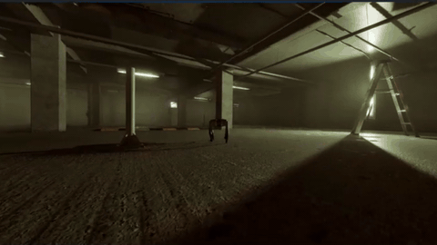 | 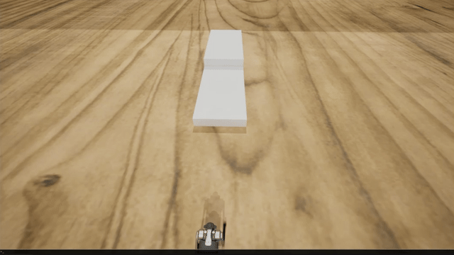 | 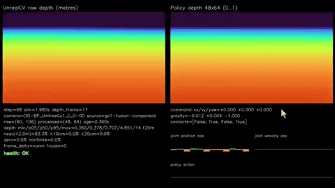 |
| Basic `I/J/K/L` locomotion demo | Advanced policy behavior rendered from outside the robot | UnrealCV raw depth and the policy depth input |

| 🚁 Runtime Drone Visual Customization | 🎭 Character Social Animation | 🌐 External 3DGS + UnrealZoo Actor |
|:---:|:---:|:---:|
| 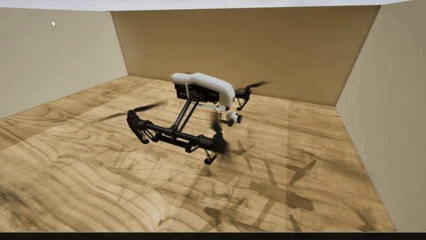 | 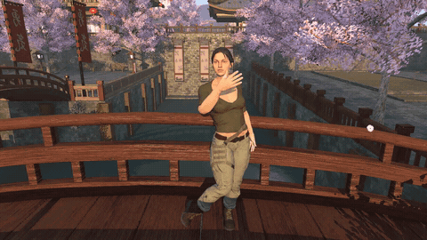 | 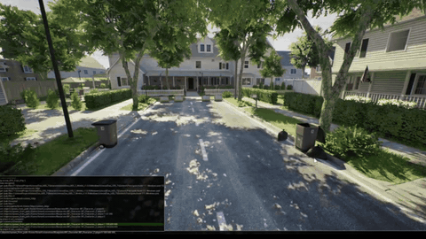 |
| [Five animated built-in models plus external Static Mesh support](example/new_features/README.md#4-runtime-drone-visual-customization) | [`set_social_anim` case-sensitive argument list](example/new_features/README.md#5-character-social-animations) | Load an external 3DGS scene and reuse an UnrealZoo-supported actor |

**🌐 Live 3D Scene Perception: Occupancy & Panoramic Depth**

| Live Occupancy and Panoramic Depth Observation |
|:---:|
| 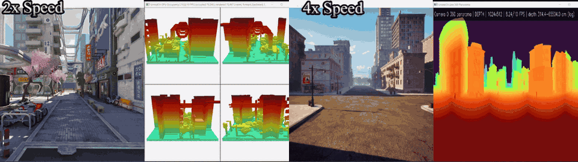 |
| Camera-relative occupancy updates and continuous 360-degree depth provide complementary geometric context for embodied perception, navigation, and spatial reasoning. See the [occupancy observation guide](https://docs.unrealcv.org/en/latest/unrealcv_plus/reference/scene-perception.html) and [GPU viewer example](example/new_features/realtime_scene_occupancy_gpu.py). |

**🤖 Runtime MCP Agent Workflows**

| Complex Scene Navigation | Scene Captioning | Character Appearance Control |
|:---:|:---:|:---:|
|  | 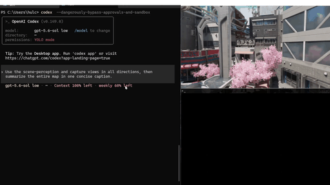 | 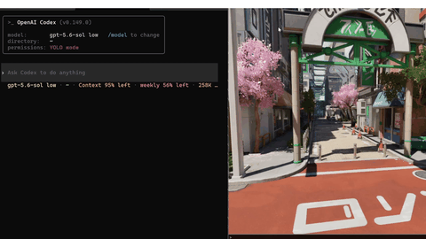 |
| Navigate between scene landmarks and verify the result from multiple camera viewpoints. | Inspect the scene, capture six directions, and synthesize a complete caption. | Discover and call the Blueprint appearance API, then capture ten character variants. |

See the [Runtime MCP examples](https://github.com/unrealcv/unrealcv-runtime-mcp) for prompts, procedures, captures, and recording workflows.

**🎥 Cine Camera**

<p align="center">
  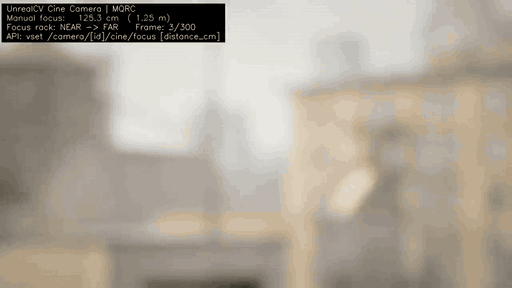
  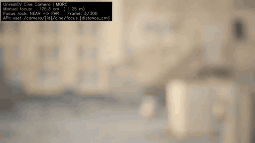
</p>

The above demos sweep the manual focus distance of the **[Cine Camera](https://docs.unrealcv.org/en/latest/reference/cine_camera.html)**.

**📡 LiDAR Street Mapping**

<p align="center">
  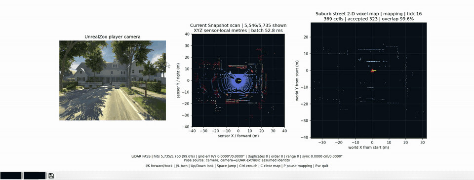
</p>

Player-controlled LiDAR observation with pose-conditioned map updates.

**🚗 Vehicle Interaction**

<div align="center">

| | | |
|:---:|:---:|:---:|
| 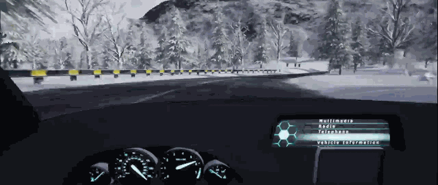 | 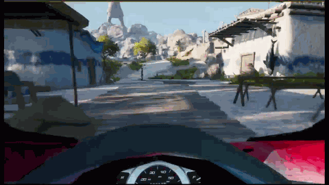 | 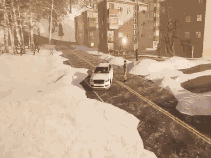 |

</div>

**🤸 Actions & Interactions**

<table><tr>
<td>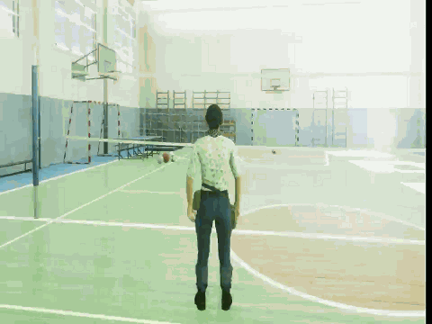</td>
<td>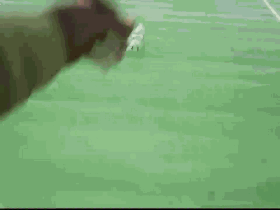</td>
<td>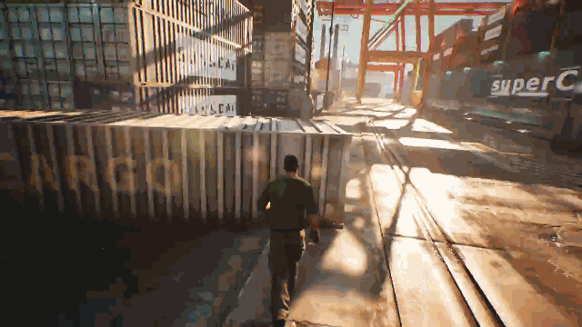</td>
<td>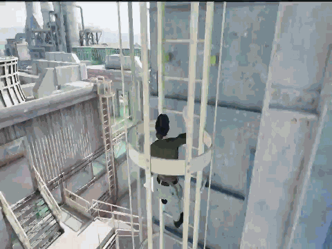</td>
<td>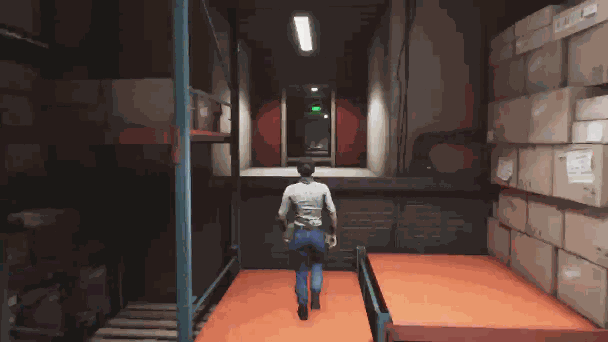</td>
</tr></table>

**🤖 Diverse Controllable Agents**

<div align="center">

| Drone | Robot Dog | Multi-Agent Collaboration |
|:---:|:---:|:---:|
| 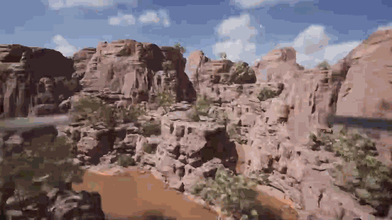 | 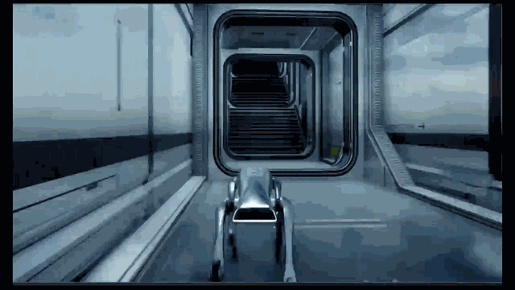 | 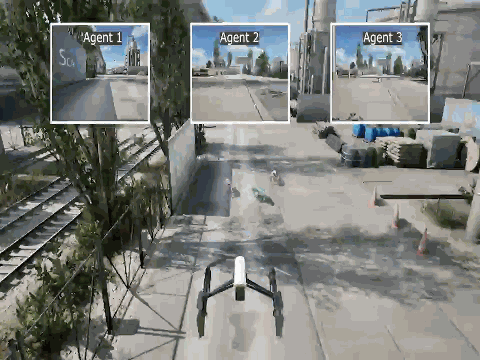 |

</div>

</div>

### 🎮 Run the Examples

<details open>
<summary><b>✨ v3.1 Feature Demos</b></summary>

Run these commands from the repository root in Windows CMD. They use the
registered environment configuration and resolve its binary from the existing
`UnrealEnv` path:

```cmd
python example\new_features\suburb_street_slam.py
python example\new_features\realtime_scene_occupancy_gpu.py --method mesh
python example\new_features\drone_mesh_switch_demo.py --interval 2 --cycles 2 --render
```

The two Go1 examples connect to a binary that you start
manually. Wait for the map and UnrealCV server to finish loading, then use the
matching port:

```cmd
python example\mujoco\go1_keyboard_control.py --host 127.0.0.1 --port 9000
python example\mujoco\go1_parkour.py --host 127.0.0.1 --port 9000 --command-mode keyboard
```

Both Go1 examples use `I/K` for forward/backward and `J/L` for turning. The
advanced example adapts the official [Robot Parkour Learning repository](https://github.com/ZiwenZhuang/parkour);
source and citation details are recorded in the [MuJoCo example guide](example/mujoco/README.md#advanced-policy-source-and-citation).

**Social animation:** See the [`set_social_anim` API and case-sensitive
argument list](example/new_features/README.md#5-character-social-animations).

See the [v3.1 feature guide](example/new_features/README.md) for arguments,
controls, asset requirements, and observation formats.

</details>

<details>
<summary><b>🌐 Dynamic 3DGS Environment Loading</b></summary>

Start the UnrealZoo v3.1 binary, open its UnrealCV command console, and load
the externally packaged 3DGS level directly:

```text
vset /action/game/level /Game/3dgs/custom_3dgs
```

The loaded level continues to use UnrealZoo agents, cameras, observations, and
interaction APIs. See the [external 3DGS package workflow](example/new_features/README.md#6-dynamic-3dgs-environment-load)
for the asset and package requirements.


</details>

<details>
<summary><b>📹 Video Data Recording</b></summary>

C++ video recording pipeline for efficient large-scale dataset collection

```bash
python example/DataRecording/VideoRecordingPipeline.py
```

**Note**: Before recording, open the binary and type `vget /unrealcv/status` to check the port number, ensure it matches the `port` parameter in the code

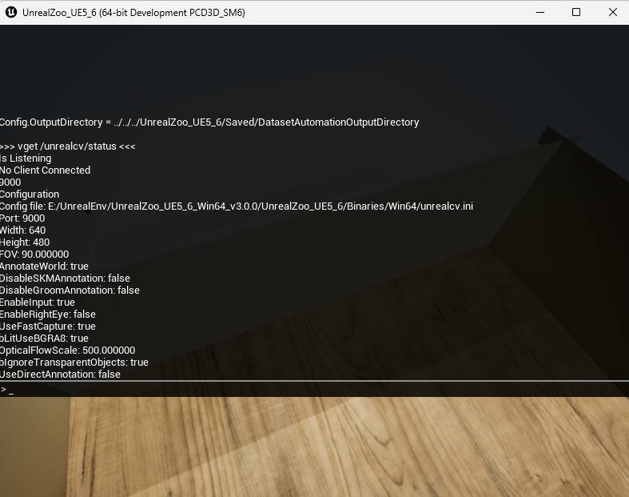

</details>

<details>
<summary><b>🎯 Multi-Agent Tracking</b></summary>

```bash
python example/tracking/basic/tracking_auto_basic.py \
  -e UnrealTrack-Greek_Island-ContinuousColor-v0
```


</details>

<details>
<summary><b>🧭 Keyboard Navigation (with Interactions)</b></summary>

```bash
python example/navigation/keyboard/navigation_keyboard_human.py \
  -e UnrealNavigation-Demo_Roof-MixedColor-v0
```

**Controls**:
- `I/J/K/L` - Move
- `↑/↓` - Look up/down
- `F` - Open door | `H` - Enter/Exit vehicle | `E` - Pickup | `Ctrl` - Crouch | `Space` - Jump | `Space x 2` - Climb

 

</details>

<details>
<summary><b>🚁 Heterogeneous Air-Ground Collaboration</b></summary>

```bash
python example/multi_agent/HeterogeneousCooperation/Aerial-Ground-Cooperative.py \
  -e UnrealTrack-Map_ChemicalPlant_1-ContinuousColor-v0
```

3 ground agents + 1 UAV collaborative tracking

</details>

<details>
<summary><b>🎮 Drone Keyboard Control</b></summary>

```bash
python example/navigation/keyboard/navigation_keyboard_drone.py \
  -e UnrealNavigation-Demo_Roof-ContinuousColor-v0
```

**Controls**:
- `W/S` - Forward/Back | `A/D` - Left/Right | `E/Q` - Ascend/Descend | `J/L` - Yaw

</details>

---

## 🏗️ Technical Architecture


### Architecture Overview

- **Unreal Engine Environments (Binary)**: Current UE5.7 runtime package containing scenes and playable entities
- **UnrealCV+ Server**: Plugin built into UE binary, including rendering, data capture, object/agent control, command parsing modules. We optimized the rendering pipeline and command system
- **UnrealCV+ Client**: Python-based utility functions for launching binaries, connecting to servers, and interacting with UE environments. Uses IPC sockets and batch commands for performance optimization
- **OpenAI Gym Interface**: Agent-level environment interaction interface, supports task customization via configuration files, includes Gym Wrappers toolkit for environment augmentation and population control

### Data Flow

```
User Algorithm (Python) ←→ Gym Interface ←→ UnrealCV Client ←→ UnrealCV Server ←→ UE5.7 Environment
                                              (Socket/WebSocket)
```

---

## 🌍 Scene Gallery

<div align="center">

**UE5 Example Scenes**


**More Scenes**: [Scene Gallery](http://unrealzoo.site/)

---

**🎮 UnrealZoo Custom Task Example**  

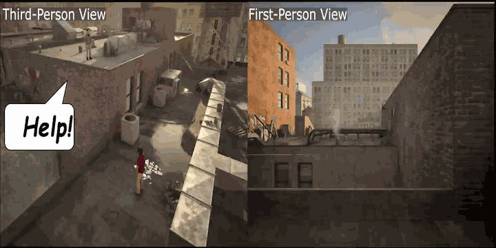  

**3D Spatial Navigation Task**

</div>

---

## 📊 Performance Metrics

| Metric | Value | Description |
|------|------|------|
| **Scene Scale** | 16 km² | Maximum single scene area |
| **Scene Count** | 100+ | Pre-built photo-realistic scenes |
| **Agent Count** | 10+ | Real-time interaction in same scene |
| **Standard Capture Throughput** | 53.46 FPS at 2K; 29.59 FPS at 4K | Camera-capture throughput benchmark; up to 6.31× speedup |
| **Serialized End-to-End Acquisition** | 22.40 FPS at 2K; 16.25 FPS at 4K | Complete serialized acquisition benchmark; not the full Gym step rate |
| **Physics Engine** | Chaos | Native physics in the current UE5.7 package |
| **Package Size** | ~70 GB | Recommended v3.1 UE5.7 full package |
| **Download Channels** | ModelScope + Hugging Face | Primary package mirrors |

Capture-throughput and serialized end-to-end values measure different parts of
the observation workflow and should not be compared as the same metric. Actual
Gym step performance also depends on the scene, enabled modalities, agent count,
and hardware. See the [v3.1 changelog](doc/CHANGELOG_v3.1.md) for the recorded
benchmark scope.

---

## 📦 Applications

- 🏆 **Offline EVT (ECCV 2024)** — Offline-RL embodied visual tracking trained and evaluated in UnrealZoo. [Paper](https://arxiv.org/abs/2404.09857) · [Code](https://github.com/wukui-muc/Offline_RL_Active_Tracking)
- 🚁 **UAV-Flow: Flying-on-a-Word** — Language-conditioned UAV imitation learning and simulation evaluation. [Homepage](https://prince687028.github.io/UAV-Flow/) · [Paper](https://arxiv.org/abs/2505.15725)
- 🧠 **EmbRACE-3K** — A 3,000+ task dataset for language-guided embodied reasoning in complex environments. [Homepage](https://mxllc.github.io/EmbRACE-3K/) · [Paper](https://arxiv.org/abs/2507.10548)
- 🎯 **ROCKET-2** — Cross-view goal alignment and visuomotor policy simulation training. [Homepage](https://craftjarvis.github.io/ROCKET-2/) · [Paper](https://arxiv.org/abs/2503.02505)
- 🛟 **RescueBench: Can Embodied Agents Save Lives in the Wild?** — A photo-realistic, multi-stage search-and-rescue benchmark built on UnrealZoo. [Paper](https://arxiv.org/abs/2606.01848) · [Code](https://github.com/UnrealZoo/RescueBench)

> 💡 **Your project also uses UnrealZoo?** Welcome to submit a PR to add to this list!

---

## 📖 Documentation

| Document                                  | Description |
|-------------------------------------------|------|
| [User Guide](doc/user_guide_latest_v3.md) | Complete usage guide (v3.0) |
| [Wrapper Guide](doc/wrapper.md)           | Environment wrapper APIs |
| [Add Environment](doc/addEnv.md)          | Custom environment tutorial |
| [CHANGELOG](doc/CHANGELOG_v4.md)          | Version update history |
| [v3.1 Changelog](doc/CHANGELOG_v3.1.md)   | v3.1 feature boundary and release highlights |
| [Example Index](example/README.md)        | All example code |

---

## 🗓️ TODO List

- [x] Release an all-in-one package of the collected environments
- [x] Add a Gym interface for heterogeneous multi-agent cooperation
- [x] Expand the list of supported interactive actions
- [x] Add detailed examples for reinforcement-learning agents
- [x] Add detailed examples for large vision-language models
- [x] Add MuJoCo Unitree Go1 integration and examples
- [ ] Integrate MetaHuman characters
- [ ] Integrate the Unitree G1 humanoid robot

---

## 🤝 Contributing & Support

- 🌐 **Official Website**: [http://unrealzoo.site/](http://unrealzoo.site/)
- 📧 **Contact Email**: [[zfw1226@gmail.com, wukui@buaa.edu.cn]]
- 💬 **Discussions**: [GitHub Discussions](https://github.com/UnrealZoo/unrealzoo-gym/discussions)

If you find this helpful, please give us a ⭐ Star!

---

## 📄 Citation

If UnrealZoo helps your research, please cite our ICCV 2025 paper:

```bibtex
@inproceedings{zhong2025unrealzoo,
  title={UnrealZoo: Enriching Photo-realistic Virtual Worlds for Embodied AI},
  author={Zhong, Fangwei and Wu, Kui and Wang, Churan and Chen, Hao and Ci, Hai and Li, Zhoujun and Wang, Yizhou},
  booktitle={Proceedings of the IEEE/CVF International Conference on Computer Vision (ICCV)},
  year={2025}
}
```

---

## 📜 License & Acknowledgments

This project is open-sourced under [Apache 2.0](LICENSE) license.

Acknowledgments:
- [UnrealCV](https://unrealcv.org/) — UE-Python communication bridge
- [OpenAI Gym](https://gym.openai.com/) — RL environment interface standard
- [Unreal Engine](https://www.unrealengine.com/) — Rendering engine
- [Smart Locomotion](https://www.fab.com/zh-cn/listings/7f881534-bf40-493b-97b4-a917daa87af0) — Character animation
- [Animal Pack](https://www.fab.com/zh-cn/listings/856c42d7-58a3-4b95-8f70-1302e5bdafa0) — Animal models
- [Drivable Car](https://www.fab.com/zh-cn/listings/65a0844c-6be4-4e38-9d7a-b9697681a274) — Vehicle system

---

<div align="center">

**[⬆ Back to Top](#)**

Made with ❤️ by UnrealZoo Team

</div>
