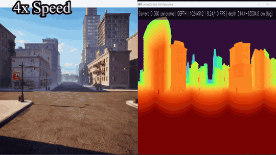
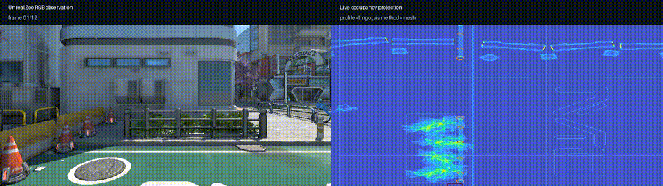

<div align="center">

<!-- Hero Banner -->
<a href="https://youtu.be/Xe2VmsJYTAU">
  
</a>
<p align="center"><i>▶️ 点击观看完整演示视频</i></p>

<!-- Title -->
<h1>UnrealZoo</h1>
<h3>Large-scale Photo-realistic Virtual Worlds for Embodied AI</h3>
<p>Production-Ready 的照片级虚拟环境，支持 100+ 场景、10+ 智能体实时协作</p>

<!-- Badges -->
<p align="center">
  
  
  
  
  
  
</p>

<p align="center">
  
  
  
  
</p>

<!-- Language Switch -->
<p align="center">
  <a href="README.md">🇺🇸 English</a> | 🇨🇳 中文
</p>

<!-- Quick Links -->
<p align="center">
  <a href="#-quick-start"><b>🚀 Quick Start</b></a> •
  <a href="http://unrealzoo.site/"><b>🌐 Website</b></a> •
  <a href="https://arxiv.org/abs/2412.20977"><b>📄 Paper</b></a> •
  <a href="https://unrealzoo.notion.site/"><b>📚 Docs</b></a> •
</p>

</div>

---

## 📖 项目概览


UnrealZoo is a rich collection of photo-realistic 3D virtual worlds built on Unreal Engine, designed to reflect the complexity and variability of the open worlds. There are various playable entities for embodied AI, including human characters, robots, vehicles, and animals.

Integrated with [UnrealCV](https://unrealcv.org/), UnrealZoo provides a suite of easy-to-use Python APIs and tools for various potential applications, such as data annotation and collection, environment augmentation, distributed training, and benchmarking agents.

**💡 This repository provides the gym interface based on UnrealCV APIs for UE-based environments, which is compatible with OpenAI Gym and supports the high-level agent-environment interactions in UnrealZoo.**

---

## 🔥 最新动态

> **UnrealZoo v3.1 在 v3.0 基础上继续扩展**，加入更快的视觉观测、三维感知、物理机器人、运行时智能体定制和外部打包环境支持。

### 🚀 v3.1 核心更新

| 特性 | 状态 | 说明 |
|------|------|----------------------------------------|
| **更快的 UnrealCV 采集** | ✅ 增强 | 标准相机在 2K 下达到 96.20 FPS、4K 下达到 65.21 FPS；当前基准中标准相机最高加速 14.66×、全景最高加速 4.96× |
| **LiDAR 观测** | ✅ 新增 | 提供 XYZI 点云观测和玩家控制的街景建图示例 |
| **占用体素观测** | ✅ 新增 | 提供兼容 LINGO 的布尔占用网格，以及 bounds/mesh 两种模式 |
| **MuJoCo Unitree Go1** | ✅ 新增 | 提供键盘运动控制和 Robot Parkour 高级策略示例 |
| **无人机运行时视觉定制** | ✅ 新增 | 无需重新生成无人机即可切换五种带动态螺旋桨的正式模型、使用定制模板，或加载兼容的外部 Static Mesh |
| **社交动画** | ✅ 新增 | 运行时选择新增的聚会、日常和车内角色动画 |
| **外部 3DGS 环境** | ✅ 新增 | 加载用户打包的 3DGS 资产并复用 UnrealZoo 智能体、相机和任务 API |
| **共享内存观测传输** | ✅ 新增 | 通过共享内存传输原始相机与占用观测，降低数据采集延迟 |
| **Runtime MCP** | ✅ 新增 | 将兼容 MCP 的智能体连接到运行中的 UnrealZoo 环境，用于场景检查和任务控制 |

📄 [v3.1 Changelog](doc/CHANGELOG_v3.1.md) · 📚 [v3.1 功能指南](example/new_features/README.md)

<details>
<summary><b>🚀 v3.0 核心更新</b></summary>

> **UnrealZoo v3.0 已发布！** 这是迄今为止最大的更新，带来完整的异构多智能体协同能力、开箱即用的交互系统，以及 UnrealCV+ Plugin 的全面升级。

| 特性 | 状态 | 说明                                     |
|------|------|----------------------------------------|
| **异构多智能体协同** | ✅ 已发布 | 地面 + 无人机编队跟随（UE内置导航/python外置导航 API示例）  |
| **模板化 Agent Spawn** | ✅ 已发布 | 运行时动态生成 agent，支持混合类别配置                 |
| **增强交互系统** | ✅ 已发布 | 开门/上下车/拾取/下蹲/跳跃/攀爬，提供 API-键盘映射便于理解交互逻辑 |
| **NavMesh 路径规划** | ✅ 已发布 | 通过 API 计算最短路径导航点，支持智能体自主导航控制，以及路径点导出   |
| **VLN Baseline 示例** | ✅ 已添加 | 将 Uni-NaVid、ViNT/NoMaD 和 StreamVLN 接入 UnrealZoo 导航任务，提供统一的 `env.step()` 示例。详见 [VLN Baseline README](example/VLN_Baseline/README.md) |

</details>

### 🔌 UnrealCV+ Plugin 升级

| 特性 | 说明 |
|------|------------------------|
| **更快的相机采集** | 标准相机在 **2K 下达到 96.20 FPS**、在 **4K 下达到 65.21 FPS**；实测标准相机最高加速 14.66×、全景最高加速 4.96× |
| **LiDAR 观测** | 提供 XYZI 点云，支持同步观测和建图工作流 |
| **占用体素观测** | 提供兼容 LINGO 的布尔场景占用网格，以及可配置的 Profile 和体素化模式 |
| **扩展全景观测** | 扩展全景采集模态，用于具身感知与数据集采集 |
| **渲染性能提升** | 图像渲染速度提升 120%，多智能体场景 FPS 大幅提升 |
| **PAK 运行时挂载** | 无需重建项目，动态扩展内容资源 |
| **全景相机支持** | 360° 等距柱状图像/视频导出，支持 VR 预览 |
| **C++ 视频录制管线** | 大规模采集工作流更高效 |
| **路径对象生成** | 通过完整资源路径直接生成对象 |
| **场景标注系统** | 支持语义分割和物体检测训练工作流 |
| **稳定 CID 相机标识** | 长期脚本配置兼容性保障 |
| **共享内存传输** | 为相机和占用数据提供低拷贝观测管线 |
| **运行时反射** | 通过 JSON 检查受支持的 Unreal 对象，并访问属性和调用函数 |
| **电影相机控制** | 提供物理相机设置与派生内参，支持可控成像 |
| **MQRC 采集** | 提供可显式控制渲染与后处理的高质量光照图像采集 |
| **Runtime MCP** | 提供面向智能体的场景概览、Actor 检查和 UnrealCV 命令执行能力 |

> 💡 全景导出、NavMesh 路径规划、无人机仿真和完整交互系统均支持开箱即用。

📄 [查看完整 Changelog](doc/CHANGELOG_v3.1.md) | 📚 [UnrealCV+ 文档](https://docs.unrealcv.org/en/latest/unrealcv_plus/index.html) | 📚 [查看 Notion 技术文档](https://www.notion.so/unrealzoo/placeholder)

### 📦 环境包下载

| 版本                               | 内容 | 大小    | 下载 |
|----------------------------------|------|-------|------|
| **最新 UE5.7 完整版（推荐）**          | UnrealZoo v3.1 完整环境包 | ~70GB | [ModelScope](https://modelscope.cn/datasets/UnrealZoo/UnrealZoo-UE5/files), [Hugging Face](https://huggingface.co/datasets/UnrealZoo/UnrealZoo_UE5) |
| **UE5.6 完整版**                      | 100+ 场景，Chaos 物理 | ~70GB | [ModelScope](https://modelscope.cn/datasets/UnrealZoo/UnrealZoo-UE5/tree/master/UnrealZoo_UE5_6_v3.0.0) |
| UE5 示例版 (1.0版本,需要使用v2.0 branch)  | 4 个示例场景 | ~10GB | [ModelScope](https://modelscope.cn/datasets/UnrealZoo/UnrealZoo-UE5/files) |
| UE4 示例版  (1.0版本,需要使用v2.0 branch) | 6 个示例场景 | ~3GB  | [ModelScope](https://modelscope.cn/datasets/UnrealZoo/UnrealZoo-UE4/files) |

### 📜 发展历程

<details>
<summary><b>点击查看历史更新</b></summary>

#### 2024-12: 论文发布
- 📝 Paper: [UnrealZoo: Enriching Photo-realistic Virtual Worlds for Embodied AI](https://arxiv.org/abs/2412.20977)
- 🌐 Website: [unrealzoo.github.io](https://unrealzoo.github.io/)
- 📚 Notion 文档: [Scene Gallery](https://www.notion.so/Scene-Gallery-a801475ff98943159da66f641f4c38b2)

#### 2025-01: UE5.6 完整环境包
- ✅ 100+ 场景，67GB 完整包
- ✅ Chaos 物理系统（载具、碰撞、爆炸、火焰）
- ✅ 物体交互系统（拾取/丢弃）
- ✅ 外观切换系统（玩家/动物类别合并）
- ✅ 跨平台二进制支持（Win/Mac/Linux 自动配置）
- ✅ ModelScope 国内镜像（高速下载通道）

#### 2025-04: v3.0 正式发布
- ✅ 异构多智能体协同
- ✅ 模板化 Agent Spawn
- ✅ 全套增强交互系统演示代码（API-键盘映射）
- ✅ NavMesh 路径规划以及任务应用演示代码
- ✅ UnrealCV+ Plugin 全面升级

#### 2026: v3.1 开发版本
- ✅ 更快的 UnrealCV 视觉观测与录制工作流
- ✅ LiDAR 和占用体素观测
- ✅ MuJoCo Go1 仿真示例
- ✅ 用户打包的 3DGS 环境支持
- ✅ 支持动态内置模型与外部 Static Mesh 的无人机运行时视觉定制
- ✅ 扩展角色社交动画

</details>

[查看完整更新日志](CHANGELOG.md)

[查看 v3.1 更新日志](doc/CHANGELOG_v3.1.md)

---

## ⚡ 30秒快速体验

```bash
# 1. 安装
pip install -e .

# 2. 设置环境路径
export UnrealEnv=/path/to/UnrealEnv

# 3. 运行多智能体追踪演示
python example/multi_agent/baseline/multi_random_baseline.py \
  -e UnrealTrack-Map_ChemicalPlant_1-ContinuousColor-v0
```

> 💡 **提示**: 首次运行需要下载 UE5 环境包（67GB），建议使用 [ModelScope](https://modelscope.cn/datasets/UnrealZoo) 国内镜像加速

---

## 🌟 核心特性

<div align="center">

| 📡 **LiDAR 观测** | 🧊 **占用体素** | 🐕 **MuJoCo Go1** | 🌐 **外部 3DGS** |
|:---:|:---:|:---:|:---:|
| XYZI 点云观测 | 兼容 LINGO 的三维网格 | 键盘与策略控制 | 加载用户打包场景 |
| 结合位姿的街景建图 | Bounds 和 Mesh 模式 | Unreal 渲染的物理仿真 | 复用智能体和任务 API |

| 🚁 **无人机视觉定制** | 🎭 **社交动画** | ⚡ **更快的 UnrealCV 采集** |
|:---:|:---:|:---:|
| 五种带动画的正式模型，另含一个定制模板 | 运行时选择角色社交动作 | 标准相机：2K 96.20 FPS、4K 65.21 FPS |
| 外部 Static Mesh 接入保留控制、物理、相机和任务状态 | 聚会、日常和车内动画组 | 标准相机最高 14.66×、全景最高 4.96× |

| 🏙️ **100+ 场景** | 👥 **10+ 智能体** | 🚗 **载具交互** | 📦 **物体操作** |
|:---:|:---:|:---:|:---:|
| 城市/自然/建筑/工业 | 同场景实时协作 | 进入/驾驶/退出 | 拾取/搬运/放置 |
| 16km² 最大场景 | 人形/车辆/动物 | 真实车辆动画 | 任意位置生成 |

| ⚡ **UE5.6 Chaos** | 🎮 **即开即用** | 🐕 **多样实体** | 🌐 **跨平台** |
|:---:|:---:|:---:|:---:|
| 碰撞/爆炸/火焰 | pip install 即运行 | 人形/车辆/动物 | Linux/Win/Mac |
| 物理级真实感 | 无需 UE 知识 | 外观实时切换 | 预编译二进制 |

</div>

---

## 🎬 系统交互演示

<div align="center">

**🐕 MuJoCo Go1 控制与跑酷**

| 键盘控制 | Parkour：第三人称视角 | Parkour：深度观测 |
|:---:|:---:|:---:|
|  |  |  |
| 基础 `I/J/K/L` 运动控制 | 从机器人外部展示高级策略行为 | UnrealCV 原始深度与策略使用的深度输入 |

| 🚁 无人机运行时视觉定制 | 🎭 角色社交动画 | 🌐 外部 3DGS + UnrealZoo Actor |
|:---:|:---:|:---:|
|  |  |  |
| [五种带动画的内置模型与外部 Static Mesh 支持](example/new_features/README.md#4-runtime-drone-visual-customization) | [`set_social_anim` 大小写敏感参数列表](example/new_features/README.md#5-character-social-animations) | 加载外部 3DGS 场景并复用 UnrealZoo 支持的 Actor |

**📡 LiDAR 街景建图**


键盘控制 LiDAR 观测，并结合实时位姿更新地图。

**🌐 全景深度观测**



UnrealCV 在相机穿行场景时持续采集全景深度视图，为具身感知、导航和空间推理
工作流提供连续的 360 度几何环境信息。

**🧊 实时占用观测**



客户端持续请求相机 RGB 和相机相对坐标系下的占用体，并随着观测位姿
变化更新已占用空间的投影视图。参见[占用观测指南](https://docs.unrealcv.org/en/latest/unrealcv_plus/reference/scene-perception.html)
和 [GPU 可视化示例](example/new_features/realtime_scene_occupancy_gpu.py)。

**🤖 Runtime MCP 复杂场景导航**


兼容 MCP 的智能体检查复杂场景，引导角色在两棵樱花树之间移动，随后分离并
重新定位相机，从多个视角验证最终结果。相关提示词、操作流程、截图和录制工作流
参见 [Runtime MCP 示例](https://github.com/unrealcv/unrealcv-runtime-mcp)。

**🚗 载具交互**

<div align="center">

| | | |
|:---:|:---:|:---:|
|  |  |  |

</div>

**🤸 动作与交互**

<table><tr>
<td></td>
<td></td>
<td></td>
<td></td>
<td></td>
</tr></table>

**🤖 多样化可控智能体**

<div align="center">

| 无人机 (Drone) | 机器狗 (Robot Dog) | 多智能体协同 |
|:---:|:---:|:---:|
|  |  |  |

</div>

</div>

---

## 🎮 交互演示 (Example Code)

<details open>
<summary><b>✨ v3.1 功能示例</b></summary>

请在仓库根目录的 Windows CMD 中运行以下命令。Demo 使用已注册环境的
配置，并通过用户已有的 `UnrealEnv` 路径自动索引 binary：

```cmd
python example\new_features\suburb_street_slam.py
python example\new_features\realtime_scene_occupancy_gpu.py --method mesh
python example\new_features\drone_mesh_switch_demo.py --interval 2 --cycles 2 --render
```

两个 Go1 示例连接到用户手动启动的 binary 或 Editor PIE。请等待地图和
UnrealCV server 完成加载，再使用与服务一致的端口运行：

```cmd
python example\mujoco\go1_keyboard_control.py --host 127.0.0.1 --port 9000
python example\mujoco\go1_parkour.py --host 127.0.0.1 --port 9000 --command-mode keyboard
```

两个 Go1 示例均使用 `I/K` 前进后退、`J/L` 转向。高级示例适配自官方
[Robot Parkour Learning 仓库](https://github.com/ZiwenZhuang/parkour)，策略来源与引用信息见
[MuJoCo 示例文档](example/mujoco/README.md#advanced-policy-source-and-citation)。

**社交动画：** 参见 [`set_social_anim` API 与大小写敏感参数列表](example/new_features/README.md#5-character-social-animations)。

参数、控制方式、资产要求和观测格式见 [v3.1 功能指南](example/new_features/README.md)。

</details>

<details>
<summary><b>🌐 动态加载 3DGS 环境</b></summary>

启动 UnrealZoo v3.1 binary，打开其中的 UnrealCV 命令行，然后直接加载
外部打包的 3DGS 地图：

```text
vset /action/game/level /Game/3dgs/custom_3dgs
```

加载后仍可继续使用 UnrealZoo 的智能体、相机、观测和交互 API。资产及内容
包要求见[外部 3DGS 流程](example/new_features/README.md#6-dynamic-3dgs-environment-load)。


</details>

<details>
<summary><b>📹 视频数据采集</b></summary>

C++ 视频录制管线，支持大规模数据集高效采集

```bash
python example/DataRecording/VideoRecordingPipeline.py
```

**说明**: 录制前打开二进制文件，输入 `vget /unrealcv/status` 检查端口号，确保与代码中的 `port` 参数一致


</details>

<details>
<summary><b>🎯 多智能体追踪</b></summary>

```bash
python example/tracking/basic/tracking_auto_basic.py \
  -e UnrealTrack-Greek_Island-ContinuousColor-v0
```


</details>

<details>
<summary><b>🧭 键盘导航（含交互）</b></summary>

```bash
python example/navigation/keyboard/navigation_keyboard_human.py \
  -e UnrealNavigation-Demo_Roof-MixedColor-v0
```

**控制说明**:
- `I/J/K/L` - 移动
- `↑/↓` - 抬头/低头
- `F` - 开门 | `H` - 上下车 | `E` - 拾取 | `Ctrl` - 下蹲 |`Space` 跳跃 | `Space x 2` 攀爬

 

</details>

<details>
<summary><b>🚁 异构空地协同</b></summary>

```bash
python example/multi_agent/HeterogeneousCooperation/Aerial-Ground-Cooperative.py \
  -e UnrealTrack-Map_ChemicalPlant_1-ContinuousColor-v0
```

3 地面智能体 + 1 无人机协同追踪

</details>

<details>
<summary><b>🎮 无人机键盘控制</b></summary>

```bash
python example/navigation/keyboard/navigation_keyboard_drone.py \
  -e UnrealNavigation-Demo_Roof-ContinuousColor-v0
```

**控制说明**:
- `W/S` - 前后 | `A/D` - 左右 | `E/Q` - 升降 | `J/L` - 偏航

</details>

---

## 🏗️ 技术架构


### 架构说明

- **Unreal Engine Environments (Binary)**: 包含场景和可玩实体的 UE5.6 运行时环境
- **UnrealCV+ Server**: 内置于 UE 二进制中的插件，包含渲染、数据捕获、对象/智能体控制、命令解析模块。我们优化了渲染管线和命令系统
- **UnrealCV+ Client**: 提供基于 Python 的工具函数，用于启动二进制、连接服务器、与 UE 环境交互。使用 IPC sockets 和批量命令优化性能
- **OpenAI Gym Interface**: 提供智能体级别的环境交互接口，支持通过配置文件自定义任务，包含环境增强、人口控制等 Gym Wrappers 工具集

### 数据流

```
用户算法 (Python) ←→ Gym Interface ←→ UnrealCV Client ←→ UnrealCV Server ←→ UE5.6 Environment
                                              (Socket/WebSocket)
```

---

## 🌍 场景画廊

<div align="center">

**UE5 示例场景**


**更多场景**: [Scene Gallery](http://unrealzoo.site/)

---

**🎮 UnrealZoo 自定义任务示例**  

  

**立体空间导航任务**

</div>

---

## 📊 性能指标

| 指标 | 数值 | 说明 |
|------|------|------|
| **场景规模** | 16 km² | 最大单场景面积 |
| **场景数量** | 100+ | 预置照片级场景 |
| **智能体数量** | 10+ | 同场景实时交互 |
| **渲染性能** | 60+ FPS | 实时多模态渲染 |
| **物理引擎** | Chaos | UE5.6 原生物理 |
| **环境包大小** | 67 GB | UE5 完整版 |
| **下载渠道** | GitHub + ModelScope | 国内加速镜像 |

---

## 🚀 快速开始

### 步骤 1: 安装依赖

```bash
git clone https://github.com/UnrealZoo/unrealzoo-gym.git
cd unrealzoo-gym
pip install -e .
```

### 步骤 2: 下载环境包

| 环境包 | 下载链接 | 大小    |
|--------|----------|-------|
| **最新 UE5.7 完整版（推荐）** | [🤖 ModelScope](https://modelscope.cn/datasets/UnrealZoo/UnrealZoo-UE5/files), [🤗 Hugging Face](https://huggingface.co/datasets/UnrealZoo/UnrealZoo_UE5) | ~70GB |
| UE5.6 完整版 | [🤖 ModelScope](https://modelscope.cn/datasets/UnrealZoo/UnrealZoo-UE5/tree/master/UnrealZoo_UE5_6_v3.0.0)  | ~70GB |
| UE5 示例场景 (1.0版本,需要使用v2.0 branch) | [🤖 ModelScope](https://modelscope.cn/datasets/UnrealZoo/UnrealZoo-UE5/files) | ~10GB |
| UE4 示例场景 (1.0版本,需要使用v2.0 branch)| [🤖 ModelScope](https://modelscope.cn/datasets/UnrealZoo/UnrealZoo-UE4/files) | ~3GB  |

解压到 `UnrealEnv` 目录：

```bash
export UnrealEnv=/path/to/UnrealEnv
```

### 步骤 3: 运行演示

```bash
# 多智能体随机策略
python example/multi_agent/baseline/multi_random_baseline.py \
  -e UnrealTrack-Map_ChemicalPlant_1-ContinuousColor-v0

# 键盘控制导航
python example/navigation/keyboard/navigation_keyboard_human.py \
  -e UnrealNavigation-Demo_Roof-MixedColor-v0
```

> 💡 **提示**: 如果鼠标消失，按 `` ` `` (Tab 上方) 释放鼠标

---

## 📦 应用案例

<div align="center">

### 🏆 Offline EVT: Empowering Embodied Visual Tracking with Visual Foundation Models and Offline RL (ECCV 2024)

**具身视觉追踪智能体**

基于 Offline RL 的主动追踪算法，在 UnrealZoo 环境中训练验证

[📄 论文](https://arxiv.org/abs/2404.09857) • [💻 代码](https://github.com/wukui-muc/Offline_RL_Active_Tracking)

---

### 🚁 UAV-Flow: Flying-on-a-Word

**语言引导无人机控制**

北航团队利用 UnrealZoo 进行仿真评估，支持语言条件的无人机模仿学习

[🌐 主页](https://prince687028.github.io/UAV-Flow/) • [📄 论文](https://arxiv.org/abs/2505.15725)

---

### 🧠 EmbRACE-3K: Embodied Reasoning

**复杂环境具身推理**

港大、清华、北师大联合构建 3,000+ 语言引导任务数据集，基于 UnrealCV-Zoo 框架

[🌐 主页](https://mxllc.github.io/EmbRACE-3K/) • [📄 论文](https://arxiv.org/abs/2507.10548)

---

### 🎯 ROCKET-2: Cross-View Goal Alignment

**跨视角目标对齐**

北大、UCLA 团队利用 UnrealZoo 进行跨视角视觉运动策略的仿真训练

[🌐 主页](https://craftjarvis.github.io/ROCKET-2/) • [📄 论文](https://arxiv.org/abs/2503.02505)

> 💡 **您的项目也使用了 UnrealZoo？** 欢迎提交 PR 添加到本列表！

</div>

---

## 📖 文档

| 文档                                  | 说明 |
|-------------------------------------|------|
| [用户指南](doc/user_guide_latest_v3.md) | 完整使用指南（v3.0） |
| [Wrapper 说明](doc/wrapper.md)        | 环境包装器 API |
| [添加环境](doc/addEnv.md)               | 自定义环境教程 |
| [CHANGELOG](doc/CHANGELOG_v4.md)    | 版本更新记录 |
| [v3.1 Changelog](doc/CHANGELOG_v3.1.md) | v3.1 功能边界与更新重点 |
| [示例索引](example/README.md)           | 所有示例代码 |

---

## 🗓️ TODO List

- ✅ Release an all-in-one package of the collected environments
- ✅ Add gym interface for heterogeneous multi-agent co-operation
- ✅ Expand the list of supported interactive actions
- [ ] Add more detailed examples for reinforcement learning agents
- [ ] Add more detailed examples for large vision-language models
- [ ] 增加 MuJoCo Unitree G1 集成与示例。

---

## 🤝 贡献与支持

- 🌐 **官方网站**: [http://unrealzoo.site/](http://unrealzoo.site/)
- 📧 **联系邮箱**: [zfw1226@gmail.com, wukui@buaa.edu.cn]
- 💬 **讨论区**: [GitHub Discussions](https://github.com/UnrealZoo/unrealzoo-gym/discussions)

如果对你有帮助，请给我们一个 ⭐ Star！

---

## 📄 引用

如果 UnrealZoo 对你的研究有帮助，请引用：

```bibtex
@inproceedings{zhong2025unrealzoo,
  title={UnrealZoo: Enriching Photo-realistic Virtual Worlds for Embodied AI},
  author={Zhong, Fangwei and Wu, Kui and Wang, Churan and Chen, Hao and Ci, Hai and Li, Zhoujun and Wang, Yizhou},
  booktitle={Proceedings of the IEEE/CVF International Conference on Computer Vision (ICCV)},
  year={2025}
}
```

---

## 📜 许可与致谢

本项目基于 [Apache 2.0](LICENSE) 协议开源。

致谢:
- [UnrealCV](https://unrealcv.org/) — UE-Python 通信桥梁
- [OpenAI Gym](https://gym.openai.com/) — RL 环境接口标准
- [Unreal Engine](https://www.unrealengine.com/) — 渲染引擎
- [Smart Locomotion](https://www.fab.com/zh-cn/listings/7f881534-bf40-493b-97b4-a917daa87af0) — 角色动画
- [Animal Pack](https://www.fab.com/zh-cn/listings/856c42d7-58a3-4b95-8f70-1302e5bdafa0) — 动物模型
- [Drivable Car](https://www.fab.com/zh-cn/listings/65a0844c-6be4-4e38-9d7a-b9697681a274) — 载具系统

---

<div align="center">

**[⬆ 回到顶部](#)**

Made with ❤️ by UnrealZoo Team

</div>
